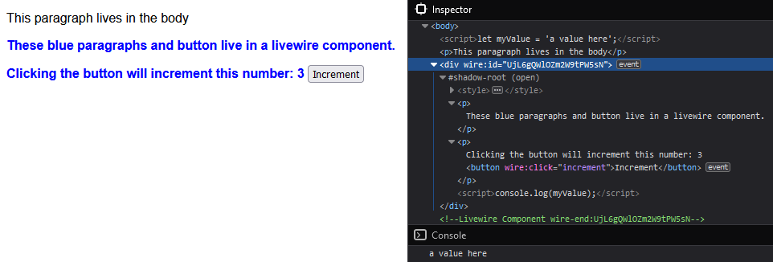

# Laravel Scoped Components

This is a **proof of concept** to show how [Shadow DOM](https://developer.mozilla.org/en-US/docs/Web/Web_Components/Using_shadow_DOM) can be used to scope css to Blade and Livewire components. Meaning that styles specified in a child component, won't leak out into the rest of the page.


## Example

### Resulting DOM:

Styles in this scoped component are applied only to the component. However the component does receive style from it's parent and can even access Javascript variables that are within the scope.

### The code:
- Parent page with no color style for paragraphs:
    ```html
    <script>
        let myValue = 'a value here';
    </script>

    <p>
        This paragraph lives in the body
    </p>

    <livewire:test-livewire-component></livewire:test-livewire-component>
    ```
- Child component with a style tag:
    ```html
    @scope
    <style>
        p {
            color: blue;
            font-weight: bolder;
        }
    </style>

    <p>
        These blue paragraphs and button live in a livewire component.
    </p>
    <p>
        Clicking the button will increment this number: {{ $count }}

        <button wire:click="increment">
            Increment
        </button>
    </p>

    <script>
        console.log(myValue);
    </script>
    @endscope
    ```


## Installation

Seeing how this is only a proof of concept and it requires a workaround I will not release this package on Packagist (yet).

Instead you must install it locally:

1. Clone/Download this repo near the project in which you want to try it.
2. Add this to your `composer.json`:
    ```
    "repositories": [
        {
            "type": "path",
            "url": "../laravel-scoped-components"
        }
    ],
    ```
3. In your project `composer require luttje/scoped-components`
4. Ensure the script in [WORKAROUND.md](WORKAROUND.md) is executed before Livewire/AlpineJS loads by putting it in your `<head>` tag.
5. Surround a section of code containing a style tag with `@scope` and `@endscope` to prevent styles from leaking out.


## Current limitations/bugs

* A [workaround](WORKAROUND.md) is needed, because neither Livewire nor AlpineJS recognize or react to changes in Shadow DOM.
* The workaround will replace all content in a dirty Livewire component. It will bypass default Livewire dom manipulation.
* For unknown reasons a variable with the name `test` in the parent will not be accessible in it's scoped component after Livewire changes the component content. Instead it will show as `Object { Symbol("Symbol.toStringTag"): "z" }`.
